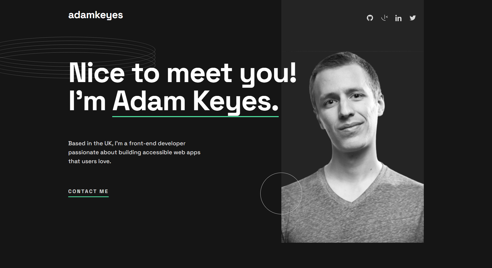
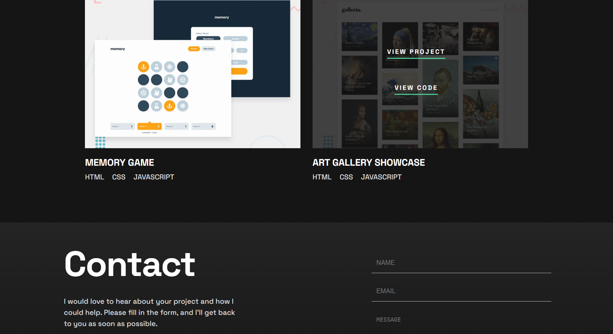
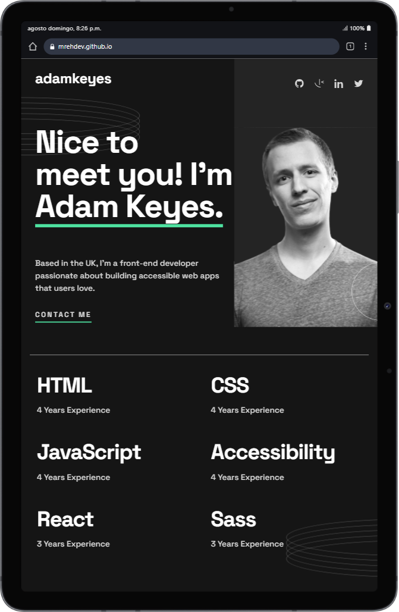
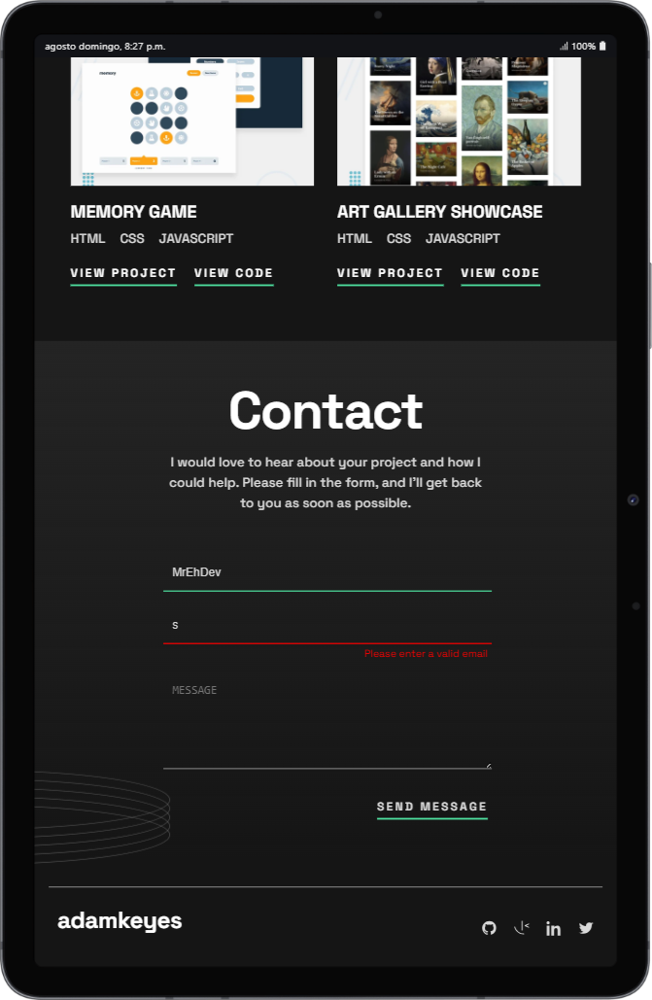
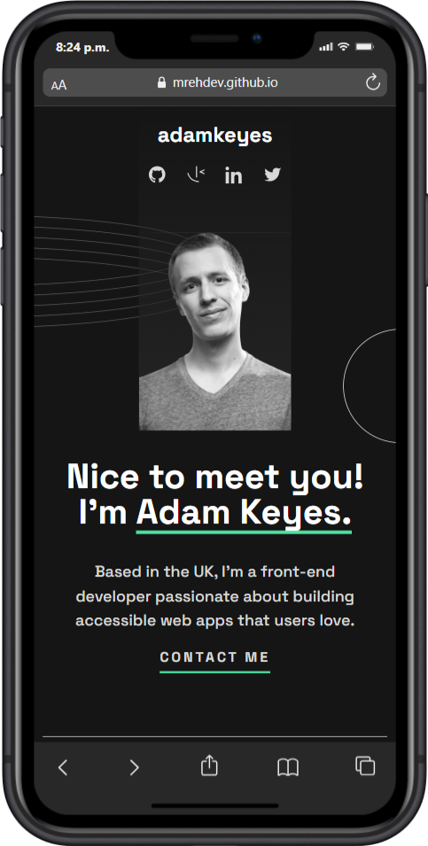
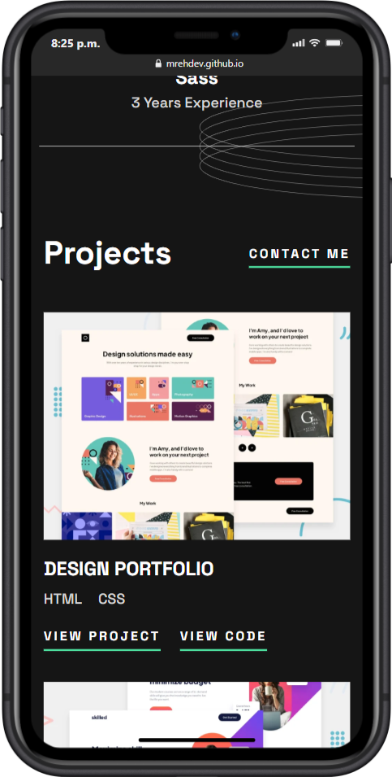

# Portfolio - Proyecto entregable

Este proyecto es la entrega del **Tarea entregable – Portfolio** del máster Full Stack.  
El objetivo es reproducir el diseño de un portfolio personal a partir de un archivo de **Figma** con un layout **responsive** y buenas prácticas en semántica, accesibilidad y organización del código.

---

## ✨ Características

- **Mobile-first**: maquetación adaptada a dispositivos móviles, escalando a tablet y desktop.
- **SCSS/SASS**: estilos organizados en parciales y variables.
- **Grid y Flexbox**: para estructurar las secciones y las cards de proyectos.
- **Hover states**: efectos de interacción en botones, iconos y proyectos.
- **Validación de formulario con JS**: campos con mensajes de error en tiempo real.
- **Decoraciones con SVG**: óvalos y círculos para reproducir el diseño de Figma.
- **Responsive**: se ajusta a distintos anchos de pantalla.

---

## 🛠️ Tecnologías usadas

- **HTML5**  
- **SCSS / SASS**  
- **JavaScript**  
- **Vite** como bundler y servidor de desarrollo  

---

## 📷 Capturas
   <div style="text-align:center;">

### Versión Desktop



### Versión Teblet



### Versión Mobile


    </div>


---


## 📦 Instalación y uso

Clona este repositorio:

```bash
git clone git@github.com:MrEhDev/CSS-Tarea-entregable-4-Portfolio.git
cd CSS-Tarea-entregable-4-Portfolio
```

Instala dependencias:

```bash
npm install
```

Ejecuta en modo desarrollo:

```bash
npm run dev
```

Genera la build de producción:

```bash
npm run build
```

Previsualiza la build:

```bash
npm run preview
```

---

## 🚀 Deploy

El proyecto está publicado en **GitHub Pages**:  
👉 [Ver demo en vivo](https://mrehdev.github.io/css-portfolio/)

---
